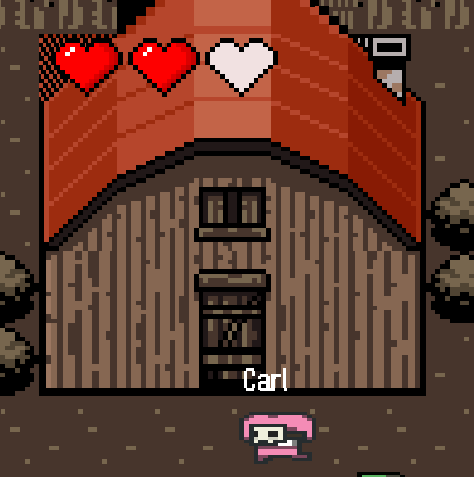

# CMPT276F23_group22

## Members: Nancy Wang, Sina MohammadiNiyaki, Derek Huang, Duy Nguyen
Us throughout the course:


## Overview
In "Dead City Chronicles," the world has changed. What was once a bustling city is now a quiet, dangerous labyrinth. Where lively streets once stood, now there are only the sounds of shuffling zombies and hidden dangers waiting for the unwary. Your mission is to collect all the keys to escape while either evading the blood-thirsty zombies or neutralizing them with vaccines.

Once you have collected all the keys, you must retreat back to this house in order to win the game.



## Instructions
First, navigate to the root directory: "phase2". In the terminal, type the following commands to build, run, and test the game

### Building the Game

```
mvn clean install
```

### Running the Game

```
java -cp .\target\phase2-1.0-SNAPSHOT.jar com.group22.Main
```


### Testing the Game
```
mvn clean test
```

